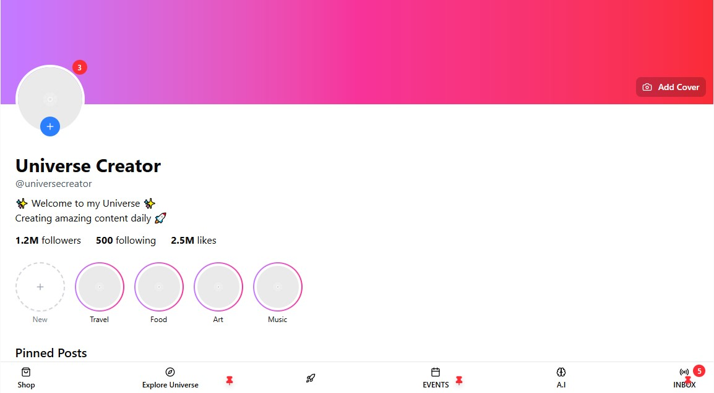
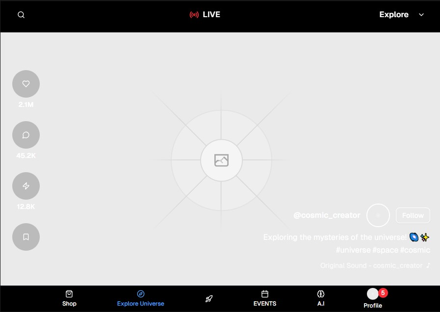
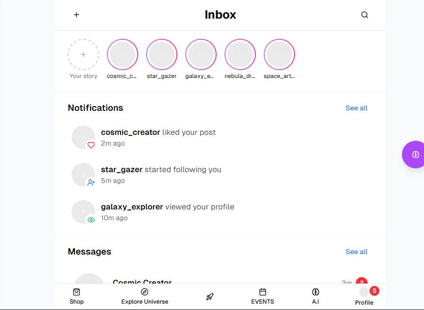
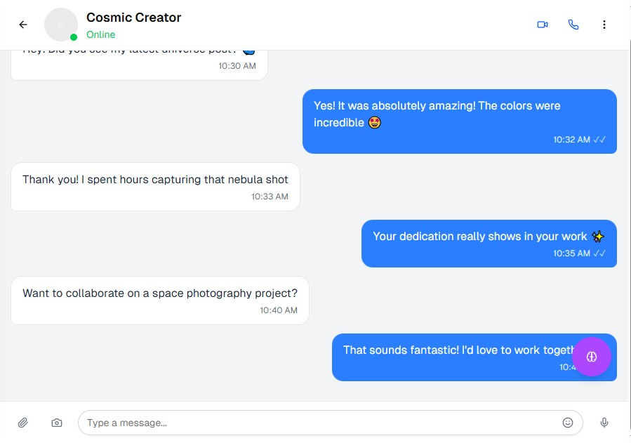
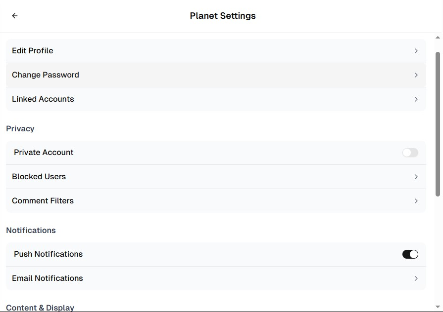
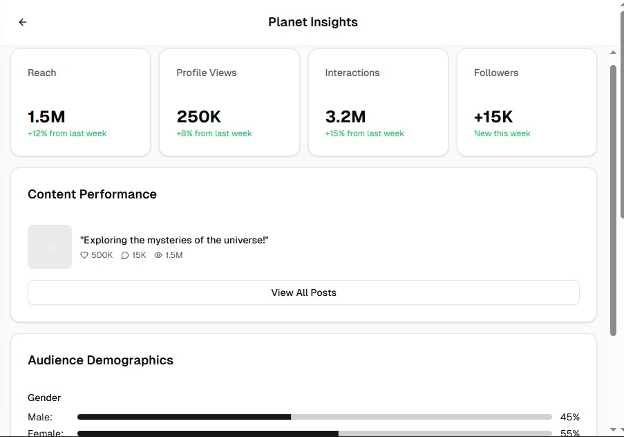
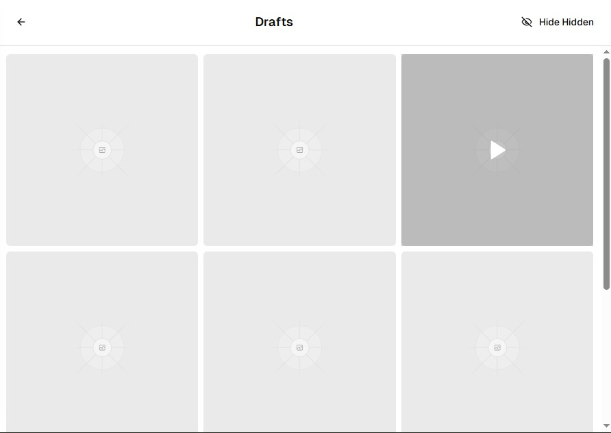
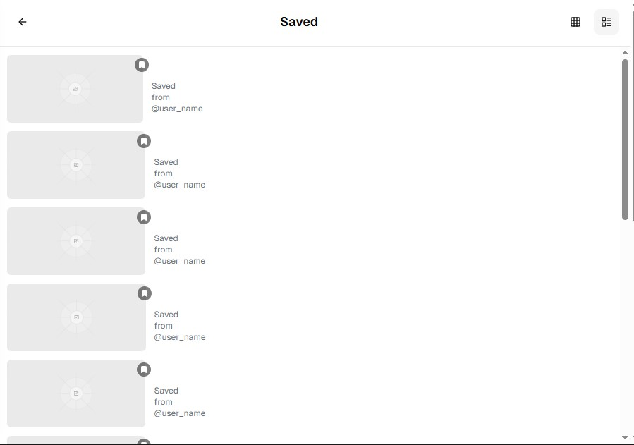
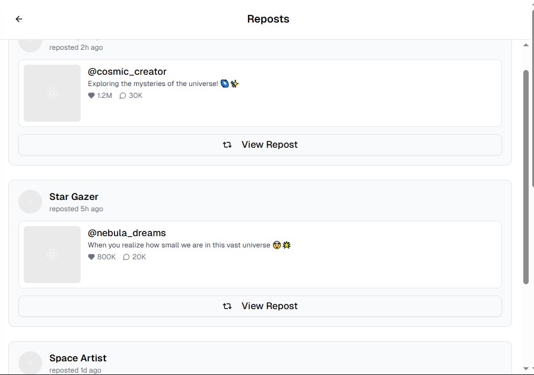

# 🌌 UNIVERSE APP

A modern social media application inspired by Instagram and TikTok, built with Next.js, React, and Tailwind CSS. Universe App provides a seamless mobile-first experience for sharing and discovering content in a cosmic-themed social platform.

## ✨ Features

### 📱 **Profile Page**
- **Responsive Design**: Optimized for all screen sizes with mobile-first approach
- **Cover Photo**: Customizable cover photo with add/edit functionality
- **Profile Picture**: Interactive profile picture with story indicator and notification badges
- **Story Highlights**: Instagram-style story highlights with custom categories
- **Post Grid**: TikTok/Instagram-style grid layout for posts
- **Pinned Posts**: Special pinned post functionality for featured content
- **Share Profile**: Easy profile sharing functionality

### 🚀 **Explore Universe Page**
- **TikTok-style Feed**: Vertical scrolling video feed experience
- **Interactive Controls**: Play/pause, volume control, and engagement buttons
- **Left-side Actions**: Like, comment, share (shooting star), and bookmark buttons
- **Live Indicator**: Real-time live streaming indicator
- **Search & Menu**: Top navigation with search and explore options
- **Comments System**: Full-featured commenting with emoji, camera, and voice note support
- **Responsive Navigation**: Bottom navigation bar that hides during interactions

### 💬 **Inbox & Messaging**
- **Stories Section**: Friend stories with add story functionality
- **Notifications Preview**: Real-time notifications for likes, follows, profile views, and tags
- **Chat List**: WhatsApp-style chat interface with online indicators
- **Real-time Chat**: Full messaging interface with multimedia support
- **Voice Messages**: Voice note recording and playback
- **Message Status**: Read receipts and delivery status

### ⚙️ **Floating Menu Options**

#### 🪐 **Planet Settings**
TikTok-inspired settings interface with:
- Account management (Edit Profile, Change Password, Linked Accounts)
- Privacy controls (Private Account, Blocked Users, Comment Filters)
- Notification preferences (Push Notifications, Email Settings)
- Content & Display options (Language, Data Saver)
- Support & About section

#### 📊 **Planet Insights**
Instagram-style analytics dashboard featuring:
- Reach and engagement metrics
- Profile view statistics
- Content performance analysis
- Audience demographics with visual charts
- Top performing posts showcase

#### 📝 **Drafts**
TikTok-style drafts management with:
- Draft posts grid view
- Hidden posts toggle functionality
- Video and image draft previews
- Easy draft editing and publishing

#### 💾 **Saved Posts**
Instagram-inspired saved content with:
- Grid and list view options
- Organized saved content display
- Easy content management
- Search and filter capabilities

#### 🔄 **Reposts**
TikTok-style repost management featuring:
- Reposted content timeline
- Original post previews
- Repost statistics and engagement
- Easy repost management

## 🛠️ Tech Stack

- **Framework**: Next.js 14 with App Router
- **Frontend**: React 18 with TypeScript
- **Styling**: Tailwind CSS
- **UI Components**: shadcn/ui
- **Icons**: Lucide React
- **State Management**: React Hooks (useState, useEffect)
- **Responsive Design**: Mobile-first approach with Tailwind breakpoints

## 📱 Mobile-First Design

Universe App is designed with a mobile-first approach, ensuring optimal performance and user experience across all device sizes:

- **Phone**: Optimized layouts and touch-friendly interactions
- **Tablet**: Adaptive layouts that scale beautifully
- **Desktop**: Enhanced experience with larger screens
- **Responsive Navigation**: Context-aware navigation that adapts to screen size
- **Touch Gestures**: Intuitive touch interactions for mobile users

## 🎨 Design Philosophy

### **Cosmic Theme**
- Space-inspired color schemes and gradients
- Cosmic terminology (Planet Settings, Universe Explorer, etc.)
- Stellar visual elements and animations

### **User Experience**
- Intuitive navigation patterns familiar from popular social platforms
- Seamless transitions and interactions
- Accessibility-first design principles
- Performance-optimized for mobile devices

### **Social Features**
- Real-time messaging and notifications
- Content discovery and engagement
- Profile customization and expression
- Community building tools

## 🚀 Getting Started

\`\`\`bash
# Clone the repository
git clone https://github.com/priestooo/universe-app.git

# Navigate to project directory
cd universe-app

# Install dependencies
npm install

# Run development server
npm run dev
\`\`\`

Open [http://localhost:3000](http://localhost:3000) to view the application.

## 📂 Project Structure

\`\`\`
universe-app/
├── app/
│   ├── page.tsx                 # Profile Page
│   ├── explore/
│   │   └── page.tsx            # Explore Universe Page
│   ├── inbox/
│   │   └── page.tsx            # Inbox Page
│   └── chat/
│       └── [username]/
│           └── page.tsx        # Chat Interface
├── components/
│   ├── ui/                     # shadcn/ui components
│   ├── planet-settings-modal.tsx
│   ├── planet-insights-modal.tsx
│   ├── drafts-modal.tsx
│   ├── saved-posts-modal.tsx
│   └── reposts-modal.tsx
└── ...
\`\`\`

## 🌟 Key Features Implemented

### ✅ **Responsive Design**
- Mobile-first approach with breakpoint optimization
- Adaptive layouts for all screen sizes
- Touch-friendly interactions and gestures

### ✅ **Social Media Core Features**
- Profile management and customization
- Content feed with engagement options
- Real-time messaging system
- Story highlights and sharing

### ✅ **Advanced Functionality**
- Comment system with multimedia support
- Voice message recording
- Analytics and insights dashboard
- Content management (drafts, saved, reposts)

### ✅ **Modern UI/UX**
- Clean, intuitive interface design
- Smooth animations and transitions
- Consistent design language
- Accessibility considerations

## 🔮 Future Enhancements

- [ ] Real-time notifications system
- [ ] Video upload and processing
- [ ] Advanced search and discovery
- [ ] User authentication and authorization
- [ ] Database integration
- [ ] Push notifications
- [ ] Content moderation tools
- [ ] Advanced analytics
- [ ] Multi-language support
- [ ] Dark mode theme

## 🤝 Contributing

Contributions are welcome! Please feel free to submit a Pull Request. For major changes, please open an issue first to discuss what you would like to change.

## 📄 License

This project is licensed under the MIT License - see the [LICENSE](LICENSE) file for details.

## 🙏 Acknowledgments

- Inspired by the best features of Instagram and TikTok
- Built with modern web technologies and best practices
- Designed for the next generation of social media users

---

**Universe App** - *Explore the infinite possibilities of social connection* 🌌✨
